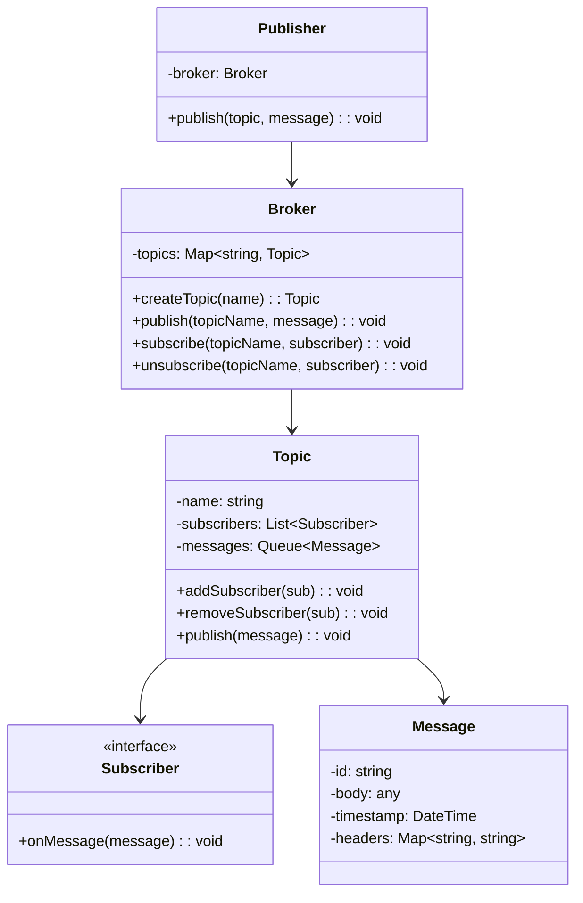
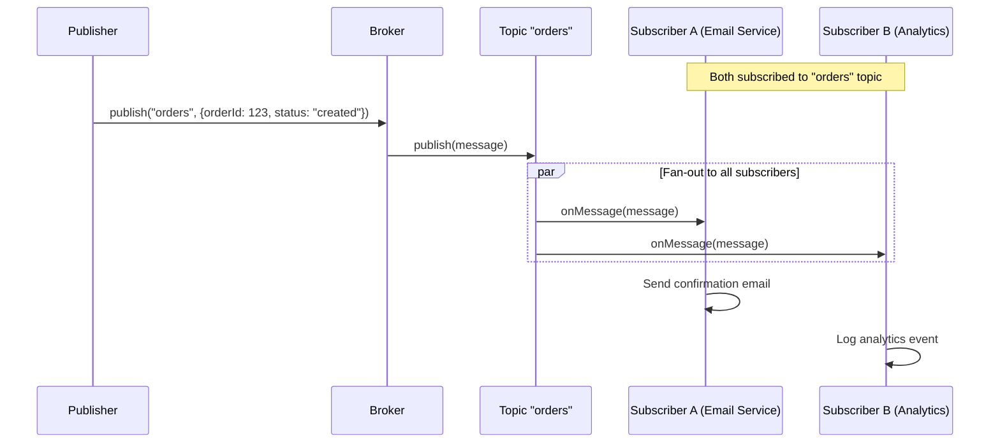

# LLD 20: Design a Pub/Sub System

## 💡 Quick Summary

> **What**: A publish-subscribe messaging system where publishers send messages to topics and subscribers receive messages from topics they're subscribed to, with decoupling between the two.  
> **Key Insight**: **Observer Pattern** at its core, but with topic-based routing and support for multiple delivery semantics (at-most-once, at-least-once). Key classes: Topic, Publisher, Subscriber, Message, Broker.

---

## 🏗️ Class Design



---

## 🔍 How It Works



---

## 💻 Implementation

```python
import threading
from collections import defaultdict
from queue import Queue
from abc import ABC, abstractmethod
from datetime import datetime
import uuid

class Message:
    def __init__(self, body, headers=None):
        self.id = str(uuid.uuid4())
        self.body = body
        self.headers = headers or {}
        self.timestamp = datetime.now()

class Subscriber(ABC):
    @abstractmethod
    def on_message(self, message: Message): pass

class Topic:
    def __init__(self, name):
        self.name = name
        self.subscribers = []
        self.lock = threading.Lock()
    
    def add_subscriber(self, subscriber):
        with self.lock:
            self.subscribers.append(subscriber)
    
    def remove_subscriber(self, subscriber):
        with self.lock:
            self.subscribers.remove(subscriber)
    
    def publish(self, message):
        with self.lock:
            subs = list(self.subscribers)  # Snapshot
        for sub in subs:
            # Each subscriber gets message in separate thread (async)
            threading.Thread(target=self._deliver, args=(sub, message)).start()
    
    def _deliver(self, subscriber, message):
        try:
            subscriber.on_message(message)
        except Exception as e:
            print(f"Delivery failed to {subscriber}: {e}")
            # Could retry, dead-letter queue, etc.

class Broker:
    def __init__(self):
        self.topics = {}
        self.lock = threading.Lock()
    
    def create_topic(self, name):
        with self.lock:
            if name not in self.topics:
                self.topics[name] = Topic(name)
            return self.topics[name]
    
    def publish(self, topic_name, message):
        topic = self.topics.get(topic_name)
        if not topic:
            raise TopicNotFoundError(f"Topic '{topic_name}' does not exist")
        topic.publish(message)
    
    def subscribe(self, topic_name, subscriber):
        topic = self.topics.get(topic_name)
        if not topic:
            topic = self.create_topic(topic_name)
        topic.add_subscriber(subscriber)
    
    def unsubscribe(self, topic_name, subscriber):
        topic = self.topics.get(topic_name)
        if topic:
            topic.remove_subscriber(subscriber)

# Usage
class EmailNotifier(Subscriber):
    def on_message(self, message):
        print(f"Sending email for: {message.body}")

class AnalyticsLogger(Subscriber):
    def on_message(self, message):
        print(f"Logging event: {message.body}")

broker = Broker()
broker.subscribe("orders", EmailNotifier())
broker.subscribe("orders", AnalyticsLogger())
broker.publish("orders", Message({"order_id": 123, "status": "created"}))
```

---

## 🔄 Delivery Guarantees

| Guarantee | Implementation | Trade-off |
|-----------|---------------|-----------|
| At-most-once | Fire and forget (current impl) | Fast, may lose messages |
| At-least-once | ACK required; retry on failure | May deliver duplicates |
| Exactly-once | ACK + deduplication (idempotency key) | Complex; slowest |

---

## 🧩 Design Patterns

| Pattern | Where | Why |
|---------|-------|-----|
| **Observer** | Topic → Subscribers | Core pub/sub pattern; decouple publisher from consumers |
| **Mediator** | Broker | Centralizes topic management; publishers don't know subscribers |

---

## 📊 Key Decisions

| Decision | Choice | Why |
|----------|--------|-----|
| Delivery | Async (thread per subscriber) | Don't block publisher; slow subscriber doesn't affect others |
| Subscriber snapshot | Copy list before delivery | Avoid ConcurrentModification if sub added during publish |
| Topic creation | Auto-create on first subscribe | Developer convenience |
| Failed delivery | Log + optional retry/dead-letter | Don't lose messages silently |
| Message ordering | Per-topic FIFO | Messages published in order, delivered in order |
